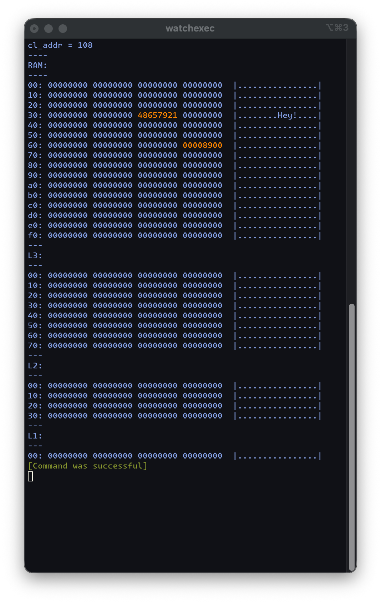
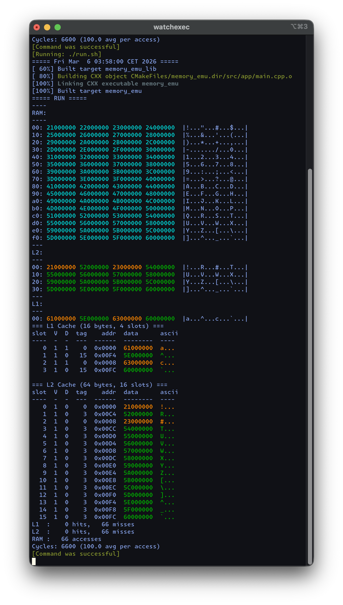
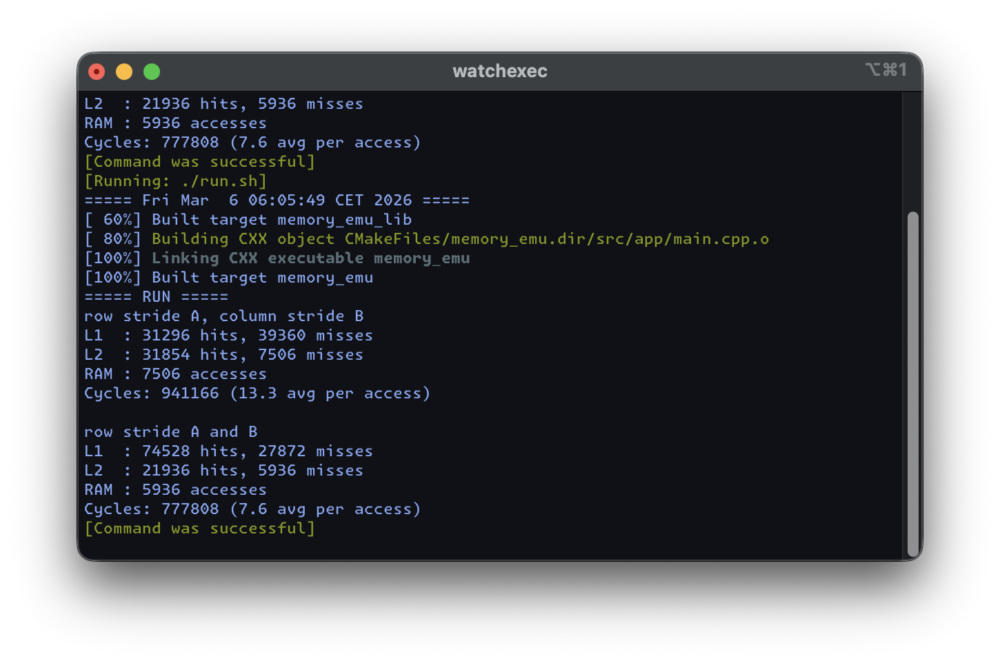

# Memory Emulator

A C++23 cache hierarchy simulator for building intuition about CPU memory access patterns. Simulates a direct-mapped L1/L2 cache with write-back policy, dirty bit tracking, and eviction cascading.

## Features

- Configurable RAM size (default 4KB, 12-bit addressing), L1 and L2 cache sizes
- Direct-mapped cache with tag/index/offset decomposition
- Write-back with write-allocate policy
- Eviction cascade: L1 dirty evict to L2, L2 dirty evict to RAM
- Color-coded terminal output: cyan (RAM non-zero), orange (dirty/stale), green (valid+clean)
- Detailed metadata view per cache slot (valid bit, dirty bit, tag, reconstructed address)
- Hit/miss statistics and cycle estimation

## Screenshots

### RAM and cache hex dump with color-coded highlighting


### Detailed cache metadata view with slot-level inspection


### GEMM access pattern comparison (ijk vs ikj loop ordering)


## Experiments

The simulator can measure the efficacy of different memory access patterns, e.g. a 32x32 GEMM with row-stride vs column-stride access on matrix B.

| | row stride A, col stride B | row stride A and B |
|---|---|---|
| L1 hits | 31,296 | 74,528 |
| L1 misses | 39,360 | 27,872 |
| L2 hits | 31,854 | 21,936 |
| L2 misses | 7,506 | 5,936 |
| RAM accesses | 7,506 | 5,936 |
| Cycles | 941,166 (13.3 avg) | 777,808 (7.6 avg) |

## Build

```bash
cmake -B build -DCMAKE_BUILD_TYPE=Debug
cmake --build build
./build/memory_emu
```

## Dependencies

- C++23 compiler (tested with Clang 19+)
- GSL (fetched automatically via CMake)
